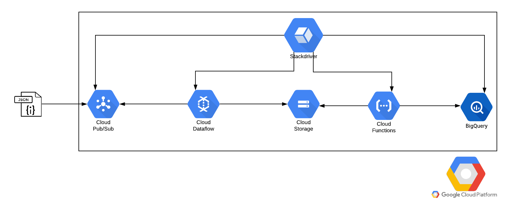

# Arquitetura Stream para integração de eventos no GCP

Esta arquitetura foi planejada para atender um processo de integração streaming, no qual qualquer evento realizado na fonte  é coletado e armazenado dentro do nosso datalake.




# Padrões de nomes

A padronização dos nomes é um passo importante para organização e manutenção do pipeline. Além disso, é fundamental para automatizar o processo. Abaixo tem um pouco mais de informações de alguns componentes e uma sugestão de padronização.

### Identificadores dos pipelines de dados

1.  Projeto de origem dos dados: **`<schema>`**;
2.  Origem dos dados: **`<instance-name>`**;
3.  Projeto no GCP: **cerc-analytics**;

### Cloud Storage

Padrão de nome para diretório de bucket para a full da operação:

-   `gs://<project>-raw-<schema>/<instance-name>`

Exemplo:

-   gs://cerc-analytics-raw-yahoo/weather

### Cloud Pub/Sub

Nome do Tópico:

-   ```projects/<project>/topics/<schema>-<instance-name>-streaming```

Por exemplo:

-   `projects/cerc-analytics/topics/yahooo-weather-streaming`

### Cloud Big Query Entrada

Nome do dataset de entrada:

-   `raw_<schema>`

Por exemplo:

-   `raw_planck`

# Monitoramento
O Stackdriver será responsável por coletar e armazenar todas os logs dos componentes apresentados na arquitetura. Com isso, teremos dashboards para ter uma visão macro do desempenho e integração do pipeline.
Cada componente emite seu próprio log, com essa visão macro podemos identificar padrões e mitigar processamento quando necessário.

# Tratamento
Quando o dataflow consome as informações via subscription do Pub/Sub, encapsula as informações em um payload genérico. Além disso, organiza o campo data com os metadados recebido no evento. Neste momento registra o momento do processamento em um campo de **process_time**, sendo essa uma informação importante para métricas no monitoramento.

# Armazenamento
No pipeline, os dados são armazenados no storage após ser consumido pelo dataflow. Entretanto, essas informações posteriormente também são armazenadas dentro do BigQuery. Podemos dizer que nosso storage seria uma forma de backup caso houver incidente no BigQuery.
O BigQuery é um bom datalake caso seja modelado de forma correta. Pelo fato da cobrança está baseada nos dados escaneados, sendo assim, particionando as tabelas ou coleções de forma correta, pode custa muito barato manipular as informações.

# Camadas de visualização

Os dados serão armazenados dentro do BigQuery. Após passas dentro do pipeline de integração, a transação fica em um formato json dentro do campo **data**. A partir disso, temos um datalake com os eventos integrados.
Para a exploração da equipe de ciência de dados, é necessário criar um novo dataset, filtrando apenas pelas informações necessárias. De acordo com o problema que deseja explorar.

# Pontos fraco
Um dos pontos fraco está relacionado ao custo do dataflow, por ser uma arquitetura Streaming será necessário deixar um dataflow constantemente monitorando o tópico do PubSub para consumir os dados.
Outro ponto é a escrita em arquivos no storage, como o arquivo é um recurso compartilhado, os processos têm um tempo determinado para escrever os dados e quando isso não acontece, pode ocorrer um erro de stuck processing. De alguma forma isso é tratado, mas precisa de análise para confirmar a hipótese.

# Pontos forte
Por mais que tem um ponto fraco relacionado a máquina do dataflow, essa é uma arquitetura de baixo custo, considerando o pipeline como um todo.
O processo de load baseado nas functions é totalmente serveless, por exemplo, ao modelar o processo para fazer o load a cada cinco minutos, é totalmente gratuito.
Outra questão está relacionado ao datalake no BigQuery, fazendo o particionamento dos dados diariamente, ao escanear determinada transação irá escanear apenas o dia específico necessário.
Ao mapear o payload genérico para para encapsular os eventos, permite flexibilidade no envio das informações sem quebrar o processo de integração. Com isso, não temos a necessidade de saber quando ocorreu mudança de schema no produtor dos dados.
Com todas as informações dentro de um dataset no BigQuery, fica mais fácil escalar o uso dos dados, seja ele por data science ou data analyst. Ficando assim, ao gosto dos usuários modelar e explorar as informações.
